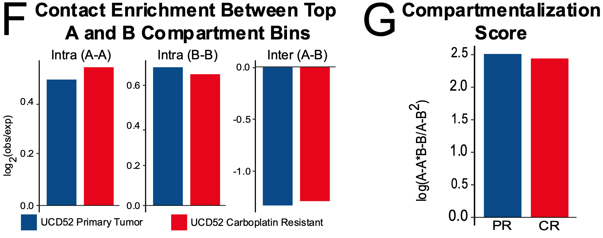

```{r xaringan-themer, include = FALSE}
library(xaringanthemer)
library(icons)
mono_light(
  base_color = "midnightblue",
  header_font_google = google_font("Noto Sans"),
  text_font_google   = google_font("Montserrat", "500", "500i"),
  code_font_google   = google_font("Droid Mono"),
  link_color = "#8B1A1A", #firebrick4, "deepskyblue1"
  text_font_size = "28px",
  code_font_size = "26px"
)
```

class: center, middle

# 3D genomics of drug resistance in breast cancer

<!-- [mdozmorov.github.io/RFU](https://mdozmorov.github.io/RFU) -->

Mikhail Dozmorov, Ph.D.   
Associate professor  
Department of Biostatistics  
Virginia Commonwealth University   

<div class="my-footer">
<a href="https://dozmorovlab.github.io/"> `r icons::fontawesome("id-card", style = "solid")` dozmorovlab.github.io</a> | 
<a href="https://github.com/mdozmorov"> `r icons::fontawesome$brands$github` mdozmorov</a> | 
<a href="https://twitter.com/mikhaildozmorov"> `r icons::fontawesome$brands$twitter` @mikhaildozmorov</a>
</div>


```{css echo=FALSE}
.pull-leftthreequarters {
float: left;
width: 80%;
}
.pull-rightquarter {
float: right;
width: 20%;
}
.pull-rightquarter ~ p {
clear: both;
}
```

---
## The 3D structure of the human genome

- Human genome is big - ~3.1 billion base pairs
    - ~2.5 billion heartbeats per average lifetime
- ~4 meters (~12ft) of the genome is packed into ~10um nucleus
    - ~10.6 miles in a golf ball (1.68in)
<!-- ~800 trips from Earth to Sun in ~30T cells from the human body-->

<div style="float: left; width: 70%;">

</div>

<div style="float: right; width: 30%;">

<div style="font-size: small;"> 
<br><br><br><br><br><br><br><br><br><br>

Human body has approximately 12 trillion DNA-containing cells (out of 37.2 T, 80% of which are DNA-free red blood cells); Stretched haploid genome would be roughly 2 meters - each cell has 4 meters of DNA (1 m = 3.28 ft); 12 T * 4 m = 48 trillion meters; Convert to miles: 48 trillion meters / 1609.34 = 2.98*10^{10}; Convert to Earth-Sun distance: 2.98*10^{10} / 91.43*10^6 = 326.22
<p>
Nucleus diameter - 10*10^{-6}m, Golf ball diameter - 42.67*10^{-3}. Scaling factor - 4.267*10^3. Scaled 4m of DNA - 17068m. In miles - 10.6mi
</div>

</div>

<!---
## Genetic variants affect 3D interactions

.pull-left[

- Genetic variants can disrupt 3D structures which leads to rewiring of enhancer-promoter interactions and gene misexpression.

- Rewiring of 3D interactome can cause malformation syndromes.

- Different variants result in different rewiring and phenotypes.
]
.pull-right[


]

.small[ Lupiáñez, DG. et al. “[Disruptions of Topological Chromatin Domains Cause Pathogenic Rewiring of Gene-Enhancer Interactions](https://doi.org/10.1016/j.cell.2015.04.004).” Cell, 2015. ]
-->

---
## Integrative genomics in three dimensions (3D)

.pull-left[ 
- 3D folding enables distant enhancer-promoter interactions and gene expression regulation. 

- Changes in the 3D genome organization are an ~~emerging~~ established hallmark of cancer and developmental disorders.

- Epigenomic signatures are associated with the 3D genome folding.
]

.pull-right[ .center[] ]

---
## Chromatin conformation capture technologies 

<!--
.pull-left[

- Ligation-based
    - Hi-C (3C, 4C, 5C)   
    - Capture-(Hi)C, ChIA-PET  
    - Single-cell variants  

- Ligation-free
    - SPRITE, GAM, ChIA-Drop  

- Specialized
    - Methyl-HiC
]

.pull-right[ 
 
<br>
<br>
]
-->

**Hi-C technology**

<center> </center>

.small[ Lieberman-Aiden, Erez et al. “[Comprehensive Mapping of Long-Range Interactions Reveals Folding Principles of the Human Genome](https://doi.org/10.1126/science.1181369)” _Science_, October 9, 2009 ]

---
## Hi-C Data as a matrix of contacts

.pull-left[
- The genome (chromosome) is split into equally sized regions

- Data is represented by a symmetric matrix of contacts $C_{ij}$ where entry $ij$ corresponds to the number of times region $i$ comes into contact with region $j$

- Off-diagonal data view - increasing **distance** between interacting regions

- Power-law decay of interactions with increasing **distance**
]

.pull-right[

]

---
## 3D genomics R packages

- [HiCcompare](https://bioconductor.org/packages/HiCcompare/) - Joint normalization to removes between-dataset biases 

- [multiHiCcompare](https://bioconductor.org/packages/multiHiCcompare/) - Differential analysis considering distance

- [SpectralTAD](https://bioconductor.org/packages/SpectralTAD/) - TAD detection using spectral clustering

- [TADcompare](https://bioconductor.org/packages/TADCompare/) - Differential and time course analysis of TAD boundaries

- [preciseTAD](https://bioconductor.org/packages/preciseTAD/) – A transfer learning framework for TAD boundary prediction

.center[]

.pull-left[ .small[[bit.ly/3Dgenomics](https://mdozmorov.github.io/Talk_3Dgenome/)] ]
.pull-right[ .small[https://github.com/mdozmorov/HiC_tools ] ]

---
## Integrative analysis of differential regions

.pull-left[ 

- Normalization and differential analysis of Hi-C datasets

- Integration of differentially interacting regions with genes, epigenomic data, motif analysis

- Manhattan plot-like visualization

.center[]

]

.pull-right[ .center[] ]

.small[ Stansfield, John C., Duc Tran, Tin Nguyen, and Mikhail G. Dozmorov. “[R Tutorial: Detection of Differentially Interacting Chromatin Regions From Multiple Hi-C Datasets](https://doi.org/10.1002/cpbi.76)” _Curr Prot in Bioinformatics_, May 24, 2019
]

---
class: center, middle

# 3D genomics of drug resistance in breast cancer

## PDX Hi-C project

<br><br>

.center[]

---
## PDX HiC project: 3D genomics of drug resistance

- Patient Derived Xenograft (PDX) mouse models of breast cancer  
- Progression of primary tumor (**PR**) to drug resistant (**CR**) states
- UCD52 - Triple-Negative Breast Cancer cells

.pull-left[]
.pull-right[]

---
## RNA-seq: Ribosomal and oxidative phosphorylation are upregulated in drug resistance

.center[]

---
## Ribosome pathway

.center[] 

---
## Oxidative phosphorylation pathway

.center[] 

---
## Drug-resistant genes enriched in aggressiveness, stemness signatures

.center[] 

---
## Upregulation of long noncoding RNAs (lncRNAs) in drug resistance

| Biotype                | Count Upregulated | Count Downregulated |  p.value  |
|------------------------|:-----------------:|:-------------------:|:---------:|
| lncRNA                 | **<span style="color:red;">317</span>** | 54 | **1.238e-42** |
| misc_RNA               |         3         |          0          | 2.696e-01 |
| polymorphic_pseudogene |         1         |          0          | 1.000e+00 |
| processed_pseudogene   |         24        |          3          | 2.088e-04 |
| protein_coding         |        1637       |         1837        | 1.065e-46 |
| ---                    |        ---        |         ---         |           |
| Total                  |        2052       |         1933        |           |

---
## Long noncoding RNAs are associated with a more aggressive breast cancer phenotype

.center[] 
.small[LncSEA, http://bio.liclab.net/LncSEA/Analysis.php]

---
## Insights from Whole Genome Sequencing

- Fewer alterations in drug resistant state, but they are longer

| Sample                    | UCD52PR                        | UCD52CR                        |
|---------------------------|--------------------------------|--------------------------------|
| Total CNVs                |                   6,638        |                   <span style="color:red;">6,126</style>        |
| Total Amp                 |                   4,100        |                   3,944        |
| Total Del                 |                   2,538        |                   2,182        |
| Amplification Length (bp) |        **700,703,500**         |        **<span style="color:red;">770,868,400</span>**         |
| Deletion Length (bp)      |        **527,398,800**         |        **<span style="color:red;">537,747,800</span>**         |
| Exonic                    |                   3,189        |                   3,090        |
| Splicing                  |                           -    |                           -    |
| NcRNA                     |                           -    |                           -    |
| Intronic                  |                      858       |                      744       |
| 5' UTRs                   |                           -    |                           -    |
| 3' UTRs                   |                           -    |                           -    |
| Upstream                  |                      115       |                      108       |
| Downstream                |                          85    |                          73    |
| Intergenic                |                   2,391        |                   2,111        |

---
## Insights from Whole Genome Sequencing

- More Novel, Synonymous, and Missense SNPs

| Sample     | UCD52PR                | UCD52CR                |
|------------|------------------------|------------------------|
| Total SNPs |        2,970,517       |        2,952,993       |
| Novel      |       **42,523**           |       **<span style="color:red;">54,643</span>**        |
| Synonymous |             **11,867**     |             **<span style="color:red;">14,215</span>**     |
| Missense   |               **9,356**    |               **<span style="color:red;">9,735</span>**    |
| Stopgain   |                    69  |                    67  |
| Stoploss   |                    25  |                    25  |
| Startloss  |                    18  |                    16  |
| Splicing   |                  150   |                  154   |
| Ti/Tv      |                 2.76   |                 2.70   |

---
## WGS: Twice as many deletions than amplifications acquired in the drug-resistant genome

- Deletions: 202.11Mb total width (6.52% of the genome)
- Duplications: 114.60Mb total width (3.70% of the genome)

.center[] 

---
## ABC transporters are amplified in drug resistance

.center[] 

---
## Known breast cancer amplicons are enriched in drug-resistant CNVs

.center[] 

---
## Gene expression and CNVs are correlated 

.center[] 

---
## Analysis of PDX Hi-C data (PDX Hi-C)

.pull-left[ 
- Mouse reads minimally affect Hi-C data - direct alignment to the human genome works well.  

- Processing pipeline plays minimal role.

- Technology is the most important for data quality.
]

.pull-right[ .center[] ]

.small[Dozmorov, Mikhail G, Katarzyna M Tyc, Nathan C Sheffield, David C Boyd, Amy L Olex, Jason Reed, and J Chuck Harrell. “[Chromatin Conformation Capture (Hi-C) Sequencing of Patient-Derived Xenografts: Analysis Guidelines](https://doi.org/10.1093/gigascience/giab022)” _GigaScience_ April 21, 2021]

---
## Hi-C: High similarity between Hi-C data replicates

.center[]

- Multi-Dimensional Scaling and hierarchical clustering show 3D differences between PR and CR replicates

---
## More interactions at shorter distances in CR

.center[] 

- Power-law distance-dependent decay of interaction frequencies (log10 scales).
- Slower decay in drug resistance (**CR**) suggests more interactions at shorter distances and fewer at longer distances.

---
## AB compartments switch to a more active state in drug resistance

.center[]

- A compartments are transcriptionally active, gene-dense regions.
- B compartments are heterochromatin/lamina-associated regions.
- In drug-resistant state, interactions within A compartments increase.

---
## AB  compartments switch to a more active state in drug resistance

.center[]

- A compartments are transcriptionally active, gene-dense regions.
- B compartments are heterochromatin/lamina-associated regions.
- In drug-resistant state, interactions within A compartments increase.

<!--
## Topologically Associating Domains are stronger in drug resistance (Aggregated TAD Analysis)

.center[] 
-->

---
## More regions are switching to an active state

.center[]

- More active compartment switches: 54.31% AA+BA changes.

- Fewer inactive compartments: 45.69% AB+BB changes.

---
## Activation of many genes, including drug resistance

.center[]

- More genes switching into active state: 669 total, 339 (BA) + 330 (AA)

- Fewer genes switching into inactive state: 350 total, 89 (BB) + 261 (AB)

---
## Drug metabolism genes switching into inactive state in drug resistance 

.center[]

---
## Nearly complete shutdown of drug metabolism

.center[]

---
## More loops in drug resistance

.center[
|           |       Loops          |      Anchors         |
|-----------|:------------------ -:|:--------------------:|
| PR total  | **10,652**           |          **21,304**  |
| CR total  | **<span style="color:red;">16,716</span>**  | **<span style="color:red;">33,432</span>**  |
| PR unique | **4,333**            |           **3,041**  |
| CR unique | **<span style="color:red;">10,397</span>**  | **<span style="color:red;">10,518</span>**  |
| PR common | 6,319                |          18,263      |
| CR common | 6,319                |          22,914      |
]

.center[]

.small[ Ardakany, Abbas Roayaei, Halil Tuvan Gezer, Stefano Lonardi, and Ferhat Ay. "[Mustache: multi-scale detection of chromatin loops from Hi-C and Micro-C maps using scale-space representation](https://doi.org/10.1186/s13059-020-02167-0)." _Genome biology_, (2020) ]

---
## Condition-specific loops are enriched in condition-specific matrices (Aggregated Peak Analysis)

.center[]  

---
## Condition-specific enhancer-promoter interactions are regulated by long-range loops

.center[] 

---
## Activation of mTOR, WNT signaling, and other cancer pathways driven by increased looping in drug resistance

.center[] 

---
## Transcription factor binding enrichment analysis

- CR vs. PR-specific loop anchors

- Open chromatin regioin (ATAC-seq) are considered

- **MEME motif enrichment**
    - PR - nothing significant
    - CR - BATF, FOS-JUN motifs

- **UniBind TFBS enrichment**
    - PR - nothing significant
    - CR - TP53, TP63, ESR1, PAX5, FOS, JUN

---
## *TP53*, *TP63*, *BATF*, and *FOS-JUN* binding is enriched in drug resistance-specific loop anchors

.center[] 

---
## Topologically Associating Domains are stronger in drug resistance (Aggregated TAD Analysis)

.center[] 

---
## Integrative analysis (late) 

Genes supported by a minimum of 4 out of 7 lines of evidence

.center[] 

---
## Increased looping around MYCN gene

.center[] 

---
## Changes in loops, TADs, CNV and gene expression

.center[] 

---
## Immunohistochemistry validation

.center[] 

---
.center[] 

---
## OXPHOS as the primary driver of chemoresistance

- Metabolic pathways, including oxidative phosphorylation ... associated with resistance.  
- IACS-010759 - OXPHOS inhibitor.  
.center[  ]
.small[https://doi.org/10.1126/scitranslmed.aav0936]

---
## Summary: 3D genomics of Drug resistance

- Transcriptome changes suggested the role of long-noncoding RNAs in drug resistance.

- Amplification of ATP-binding cassette (ABC) transporters.

- Increased short-range (<2Mb) interactions and chromatin loops.

- Chromatin state switching into a more active state.

- Members of the TP53 family of transcription factors, as well as FOS-JUN proteins, appear to drive drug resistance.

- Integrative analysis highlighted increased ribosome biogenesis and oxidative phosphorylation, suggesting the role of mitochondrial energy metabolism.

<!-- 
## Acknowledgements - mentees

.center[] 

Partnering with the "Bioinformatics and Genomics" program at the University of Oregon to mentor students and hire interns. 
https://internship.uoregon.edu/bioinformatics 

.small[ https://dozmorovlab.github.io/members.html ] -->

---
## Acknowledgements
.center[
.pull-left[ 

J. Chuck Harrell, Ph.D., Associate professor ]
.pull-right[ 

Maggie Marshall, M.S., Senior Research Assistant ]
Ferhat Ay (La Jolla Inst. Immunology)  
Sushmita Roy (UW Madison)  
.small[ Mikhail G. Dozmorov, Maggie A. Marshall, Narmeen S. Rashid, Jacqueline M. Grible, Aaron Valentine, Amy L. Olex, Kavita Murthy, Abhijit Chakraborty, Joaquin Reyna, Daniela Salgado Figueroa, Laura Hinojosa-Gonzalez, Erika Da-Inn Lee, Brittany A. Baur, Sushmita Roy, Ferhat Ay, J. Chuck Harrell ]
]

---
class: center, middle

# Thank you

<br>
mdozmorov@vcu.edu
<br>

Questions?

<br> &nbsp;

Blick Research Fund  
PhRMA Foundation   
American Cancer Society  

.center[]

<div class="my-footer">
<a href="https://dozmorovlab.github.io/"> `r icons::fontawesome("id-card", style = "solid")` dozmorovlab.github.io</a> | 
<a href="https://github.com/mdozmorov"> `r icons::fontawesome$brands$github` mdozmorov</a> | 
<a href="https://twitter.com/mikhaildozmorov"> `r icons::fontawesome$brands$twitter` @mikhaildozmorov</a>
</div>


<!--
## Interpretation of differentially interacting chromatin regions (DIRs)

- **Visualization of DIRs.** A Manhattan-like plot of DIRs may inform us about abnormalities or reveal chromosome site-specific enrichment of differentially interacting regions

.center[]


## Interpretation of differentially interacting chromatin regions (DIRs)

- **Overlap between differentially expressed genes and DIRs.** If gene expression measurements are available, differentially expressed genes may be tested for overlap with DIRs - test the link between DIRs and changed gene expression

- **Functional enrichment of genes overlapping DIRs.** DIRs may disrupt specific pathways/functions - test whether genes overlapping DIRs are enriched in a canonical pathway or share a common function


## Interpretation of differentially interacting chromatin regions (DIRs)

- **Overlap enrichment between TAD boundaries and DIRs.** DIRs may correspond to TAD boundaries that are deleted or created - test DIRs for significant overlap with TAD boundaries detected in either condition or only in boundaries changed between the conditions

- **Overlap between DIRs and transcription factor binding sites.** DIRs may correspond to the locations where proteins bind to DNA, such as CTCF sites - test for enrichment of DIRs in any genome annotation (epigenomic mark)


## Interpretation of differentially interacting regions

.pull-left[ .center[] ]

.pull-right[ .center[] ]

.small[ Stansfield, John C., Duc Tran, Tin Nguyen, and Mikhail G. Dozmorov. “[R Tutorial: Detection of Differentially Interacting Chromatin Regions From Multiple Hi-C Datasets](https://doi.org/10.1002/cpbi.76)” _Curr Prot in Bioinformatics_, May 24, 2019
]

class: center, middle

# preciseTAD


## Machine learning for TAD boundary prediction

.pull-left[ 
- **preciseTAD** – a random forest model using genomic annotations for predicting the probability of each base being a boundary

- Train a model on low-resolution Hi-C regions - binary classification of annotated boundary/non-boundary regions

- Apply the model to each annotated base - predict the likelihood of a base being a boundary

]

.pull-right[ .center[] 
]

.small[ Stilianoudakis, Spiro C. “[PreciseTAD: A Machine Learning Framework for Precise 3D Domain Boundary Prediction at Base-Level Resolution](https://doi.org/10.1101/2020.09.03.282186)” _bioRxiv_ Sept 29, 2020]


## Machine learning for TAD boundary prediction

.pull-left[ 

- Different resolutions (5kb)

- Four feature engineering techniques (distance)

- Four approaches to class imbalance (RUS or SMOTE)

- Three types of genome annotations (Transcription factors (CTCF, SMC3, RAD21, ZNF143), Histone modifications, Chromatin states)
]

.pull-right[ .center[] 
]

.small[ Stilianoudakis, Spiro C. “[PreciseTAD: A Machine Learning Framework for Precise 3D Domain Boundary Prediction at Base-Level Resolution](https://doi.org/10.1101/2020.09.03.282186)” _bioRxiv_ Sept 29, 2020]


## Machine learning for TAD boundary prediction

.pull-left[ 
- DBSCAN clustering and PAM to identify boundary regions and summit points  

- Summits are highly enriched in CTCT et al. signal

- Pre-trained models predict boundaries using only genome annotation data 

.small[ Stilianoudakis, Spiro C. “[PreciseTAD: A Machine Learning Framework for Precise 3D Domain Boundary Prediction at Base-Level Resolution](https://doi.org/10.1101/2020.09.03.282186)” _bioRxiv_ Sept 29, 2020]
]

.pull-right[ .center[] 
]
-->
